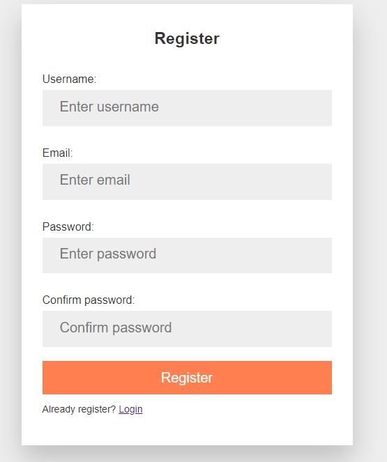

# Aplicación MERN de autenticación

Aplicación de autenticación desarrollada con el stack MERN (MongoDB, Express, React y Nodejs):

- Registro

  

- Inicio de sesión

  

- Olvidé contraseña

  

- Reseteo de contraseña

  

Módulos utilizados:

### Frontend:

- Axios
- React-router-dom

### Backend:

- bcryptjs
- dotenv
- express
- jsonwebtoken
- mongoose
- nodemailer

Para instalar aplicacion ejecutar:

```
npm install
cd client
npm install
```

Para iniciar aplicacion ejecutar

```
npm run server
cd client
npm start
```

------

